This document will introduce you how to do the batch processing step by step. It totally has 5 steps:

1. Test project to find out whether config works
2. Batch loading images and marker detection
3. Batch align photos
4. Change bounding box (bbox) of processing area
5. Run reconstruction and export results

Link: `your/data/root/path`

```plaintxt
.
├── 00_rgb_raw
│   ├── broccoli_tanashi_5_20211021_P4RTK_15m
│   │   ├── DJI_0224.JPG
│   │   ├── ...
│   │   └── DJI_0226.JPG
│   ├── broccoli_tanashi_5_20211025_P4RTK_15m
│   ├── ...
│   └── broccoli_tanashi_5_20220412_P4RTK_15m
├── 01_metashape_projects
│   ├── bbox.pkl
│   ├── broccoli.files
│   ├── broccoli.psx
│   └── outputs
└── 02_GIS
    └── gcp.csv
```

# Step 1: Test project

The key features of this step are as follows:

* Test whether config.json and scripts works on your data.
* Find out the correct ID between GPS coordinates and coded targets.
* Define the bounding box of plot.

Please follow these steps:

1. Open an empty metashape project, remove the `Chunk 1`
   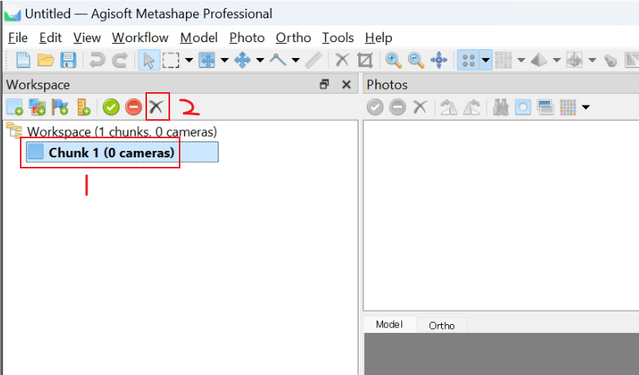

   and save the project on your disk
   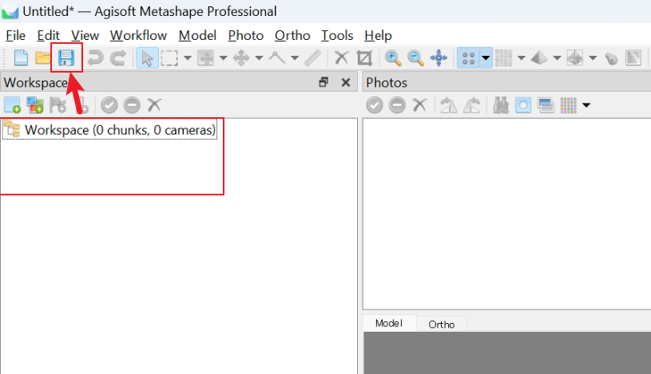
2. Edit the `config.json` in [10_agisoft_batch_tools/config.json](.10_agisoft_batch_tools/config.json)

   ```json
   {
       "img_path": "your/data/root/path/00_rgb_raw",
       "test_folder": ["subfolder_a"],

       "skip_folder": ["subfolder_a", "subfolder_b", "subfolder_c"],
       "ref_csv": "your/data/root/path/02_GIS/gcp.csv",

       "bbox_pkl_path": "your\\data\\root\\path\\01_metashape_projects\\bbox.pkl"
   }
   ```

   To accelerate the test step (no need to load all flights), only recommend use one or two subfolder (flight) as test. The script will only load  `test_folder` into the test project.

   The `skip_folder` contains some bad flights and should never be used.

   Please note, only `/` or `\\` are acceptable for the path string, the Windows default paste `'E:\aaaa\bbbb'` doesn't work and can cause error.
3. Create the `gcp.csv` in your data root path `02_GIS`

   By default, using the RTK GPS device to measure ground control points in field, may get the table like this:

   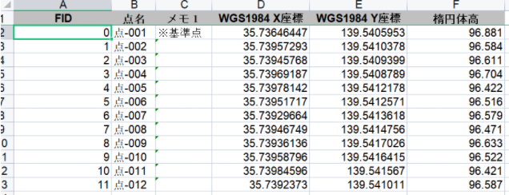

   the FID is often not corresponding to the coded target id.

   Please copy and paste the XYZ data to `gcp.csv`, the columns are (the order is very important!):

   | id  | longitude   | latitude    | altitude |
   | --- | ----------- | ----------- | -------- |
   | 0   | 139.5405953 | 35.73646447 | 96.881   |
   | 1   | 139.5410378 | 35.73957293 | 96.584   |
   | ... | ...         | ...         | ...      |

   PS: No need to add the header line into csv file:


   ```csv
     0, 139.5405953, 35.73646447, 96.881
     1, 139.5410378, 35.73957293, 96.584
     ... 
   ```

   PPS: The id here can be any distinguisable id, either FID or `点名` or any other non duplicated string. Then we will edit it again later.
4. run `10_agisoft_batch_tools/00_create_tested_project.py` in metashape

   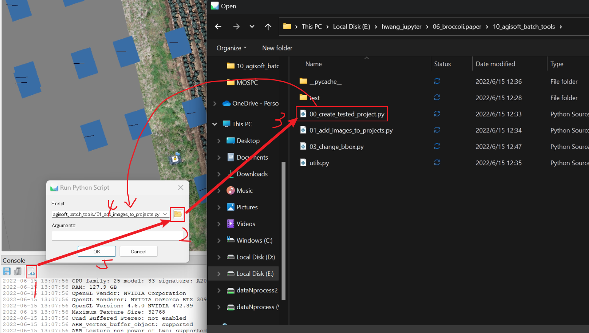

   it auto adds metashape flights as chunk

   

   Also it will display the UAV positions (dots) and ground control points positions (flags), however those auto-detected "target_x" are not shown.

   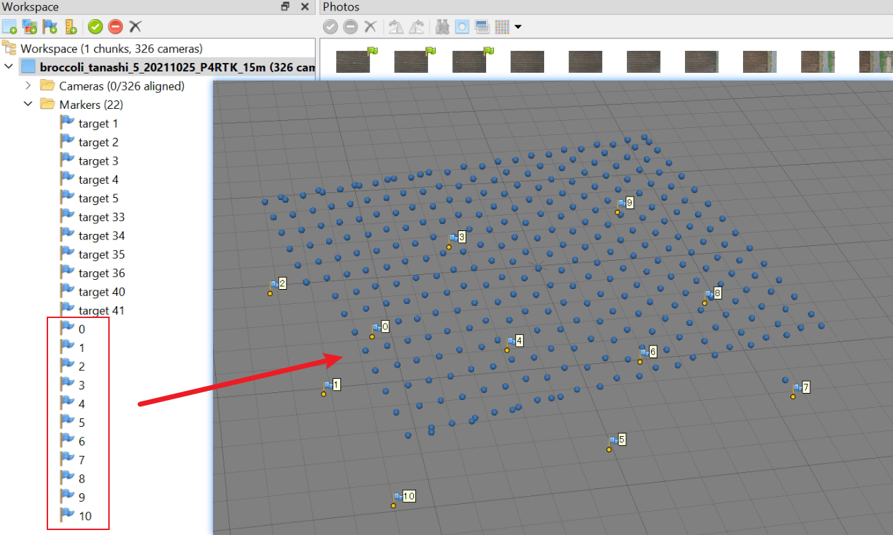

   No worry about it, we will display it later.
5. Edit the flight height of all the chunks

   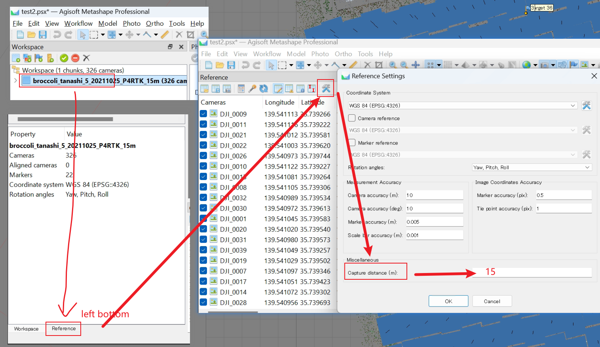

   Important: You need to manual setting for ALL chunks, no API for automatically edit this currently.

6. Then load the `02_align_photos_all_chunks.xml` script by:

   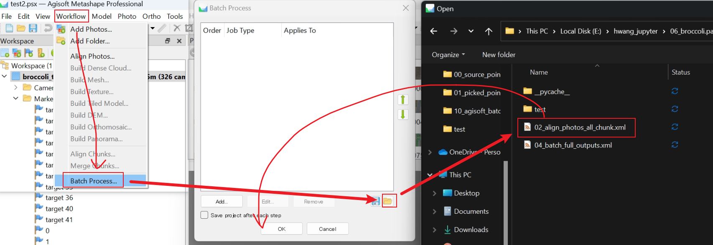

   > If you meet the error `can not load the script`, please either update your metashape version (Recommended), or edit the xml file:
   > ```xml
   > <?xml version="1.0" encoding="UTF-8"?>
   >   <batchjobs version="1.8.0">  // edit here to match
   > ...
   > ```

   Then you the target_x are also appears in the software:

   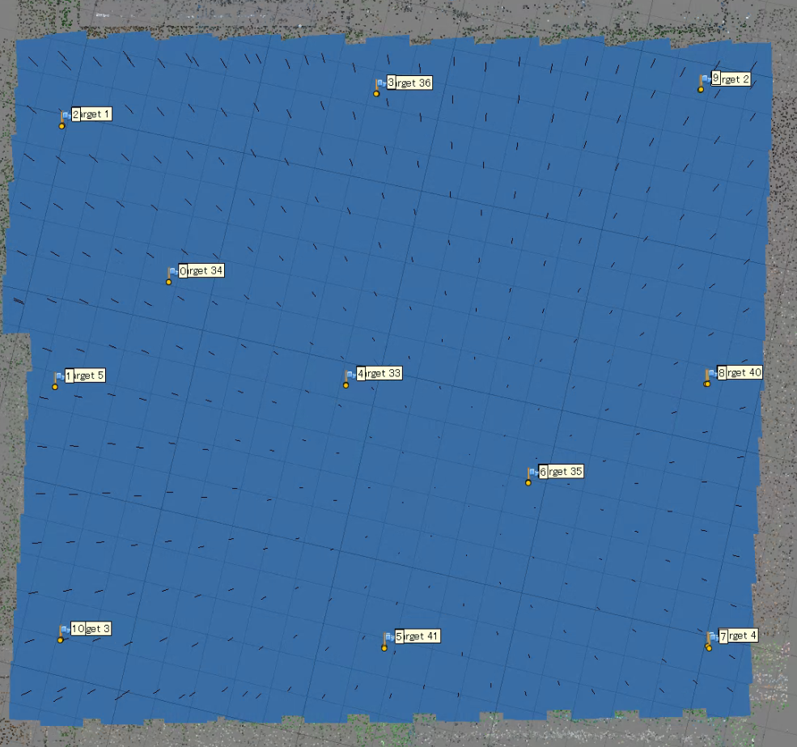

   Please edit the `gcp.csv` according to the previous relationship,

   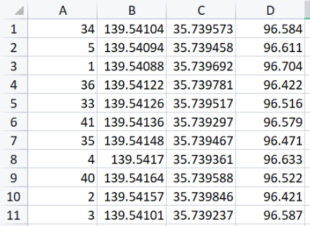
7. Finally, change the plot bounding box to a proper size

   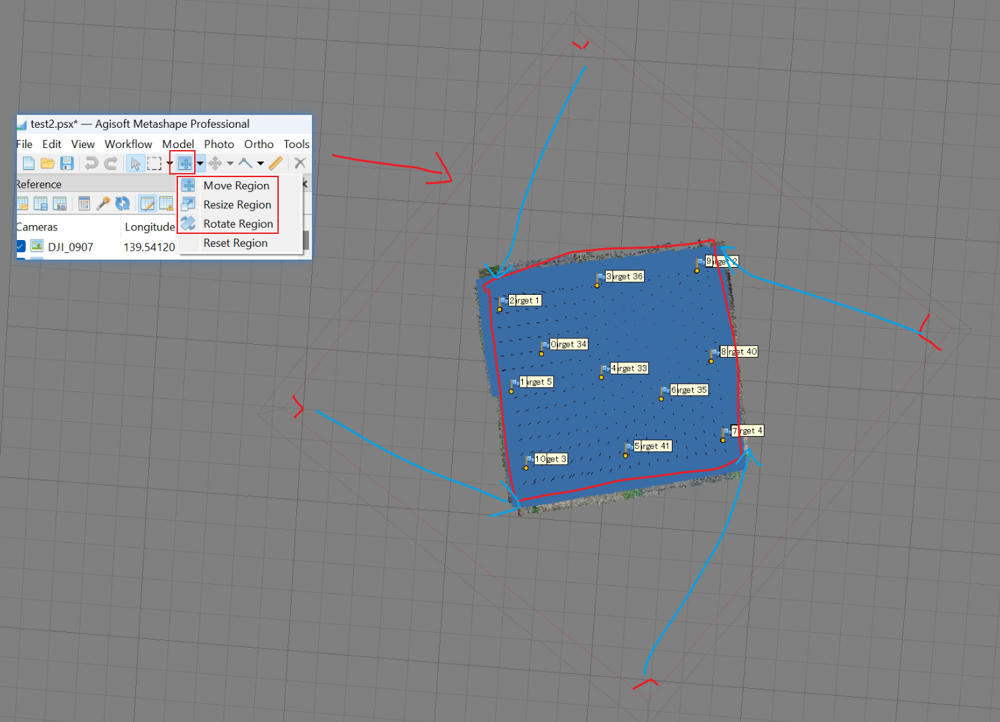

   Then run the `03_change_bbox.py` script like step 1.4 mentioned. You will save the adjusted bounding box to `*.pkl` file for later use.

   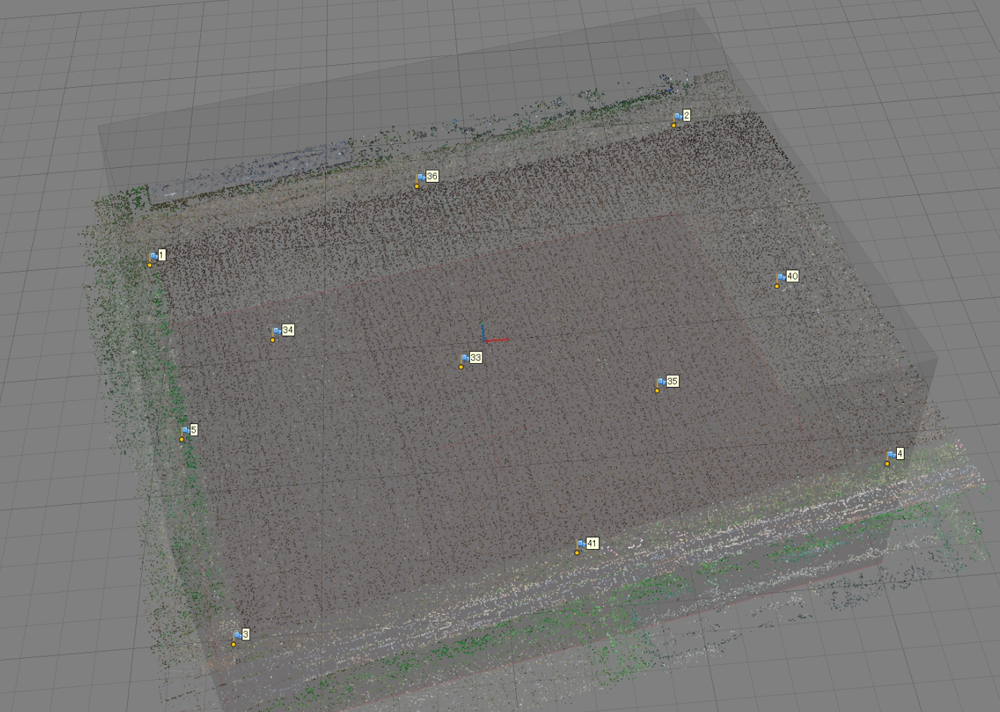
8. Then the test project can be removed

# Step 2: Batch apply to all

1. Open a new metashape, delete default `Chunk 1` and save project as **Step 1.1**
2. Run `10_agisoft_batch_tools/01_add_images_to_projects.py` as **Step 1.4**
3. Manually adjust the Capture distance for each chunks, as **Step 1.5**
4. Batch process `10_agisoft_batch_tools/02_align_photos_all_chunks.xml` as **Step 1.6**
5. Manual check if all chunks are in good condition
6. Run `10_agisoft_batch_tools/03_change_bbox.py` to batch modify all chunks' bbox
7. Batch export results by `10_agisoft_batch_tools/04_batch_full_outputs.xml`, the results will save to `your/data/root/path/01_metashape_projects/outputs`


# Step 3: Append flights

The previous pipeline can be run again when you have new flight data. But the already existed chunks (flights) will be ignored. Please **DO NOT** change images that already been exported and processed into the project.
