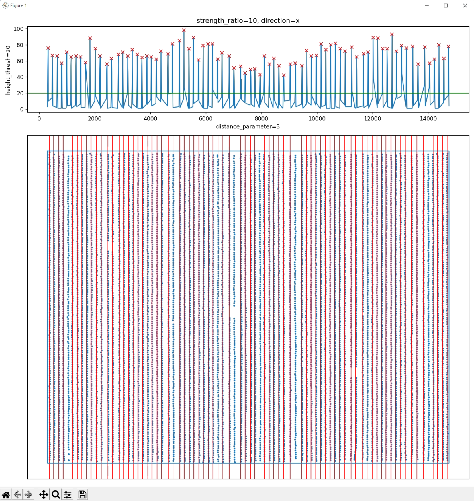

# Step 3: Yolo v5 detect broccoli seedlings

This setups have already been packed into python batch scripts:

```plaintxt
.11_root_pos
├── 01_slice_dom.py
├── 02_prepare_yolo_data.py
├── 03_train_yolov5.py
├── 04_apply_yolov5.py
├── 05_yolo2shp.py
├── 06_order_by_ridge.py
└── config.py
```

The `config.py` contains almost all the parameters used in the following procedures, only need to modify here, you don't need to edit all of them at the beginning, you can edit this steps by steps with the following protocols.

Very first, please specify the two folders mentioned above:

```python
###########
# 00 init #
###########
easyidp_package_path = "path/to/github/UAVbroccoli/EasyIDP"
project_data_folder = "path/to/your/broccoli_data_folder"
working_spacename = "11_root_position"
```

## 3.1 Split DOM to small parts

please specify the following paramters in `config.py`

```python
################
# 01 slice dom #
################
dom_path_for_detection = f"{project_data_folder}/01_metashape_projects/outputs/broccoli_tanashi_5_20211101_0_dom.tif"
dom_slice_save_folder = f"{project_data_folder}/{working_spacename}"
dom_slice_save_format = "jpg"
dom_slice_length = 1300   # must be a square
dom_slice_buffer = 200
```

* `dom_path_for_detection`: the DOM with broccoli buds, better with clear weather (as few variation as light as possible), recommended using status like the following images:

  ​​
* `dom_slice_save_folder`: the folder to save clipped dom regions
* `dom_slice_save_format`: jpg, png, or tif (with geo info, not necessary for this detection)
* `dom_slice_length`: the size of each small regions, unit is pixel
* `dom_slice_buffer`: the length of buffered regions, unit is pixel

  

  The green part is the buffer region to avoid imcompete broccoli on edge, 200 pixel extend to right and bottom

Then you can run the script by:

```bash
# please cd to the folder 11_root_pos first
path/to/github/UAVbroccoli/11_root_pos> conda activate uavbroccoli
(uavbroccoli)path/to/github/UAVbroccoli/11_root_pos> python 01_slice_dom.py
grid_x15_y13.jpg | 100.0 % done | 19 s passed, 0 s left
Cost 19 s in total
```

Will get the following results:

```bash
11_root_position
└── jpg
    ├── broccoli_tanashi_5_20211101_0_dom.tif
    │   ├── grid_x00_y02.jpg
    │   ├── grid_x00_y03.jpg
    │   ├── ...
    │   └── grid_x14_y11.jpg
    └── broccoli_tanashi_5_20211101_0_dom.tif.json
```

## 3.2 Prepare yolo data

First, run `labelme.exe` to annotate training data for yolov5.

* Remember to **unclick** the "save with image data", otherwise it will make a huge training data json file

  
* Then, Open Dir (<kbd>Ctrl</kbd> +<kbd>U</kbd>), choose the previous `jpg/broccoli_tanashi_5_20211101_0_dom.tif` folder
* Select 1-2 representative images at file list, then `Edit -> create Rectange`

  
* Draw one rectange, and name the label name

  
* Repeat previous step to mark all buds, and alwasy use the previous label name (**don't** change to bud1, bud2, etc.)

  
* Then save as, choose a proper folder to save json file (don't rename json file, just leave as default)

  

  
* Repeat previous steps, label 2-3 representative images

  

Then run edit the config.py, to specify the labeled folder:

```python
############################
# 02 prepare yolo database #
############################
labelme_json_data_pool = {
    # data_id: folder contains labelme json
    "2021a":f"{project_data_folder}/{working_spacename}/labelme_json",  # 2021 autumn train data  
    # also acceptable for several different folders as total training data pool
    "2021s":"Z:/hwang_Pro/data/2021_tanashi_broccoli/11_instance_seg/yolo_json", # 2021 summer train data
    "2020":"Z:/hwang_Pro/data/2020_tanashi_broccoli/11_instance_seg/yolo_json", # 2020 train data
    "2019":"Z:/hwang_Pro/data/2019_tanashi_broccoli5/11_instance_seg/yolo_json",  #2019 train data
}
train_database_path = f"{project_data_folder}/{working_spacename}/yolo_train/training_database"
# optional
train_database_name = "broccoli_root"
```

* `labelme_json_data_pool`: you can add all your training data folder of different year, please use python dictionary:

  ```python
  {"key1": "path1", "key2": "path2"}
  ```
* `train_database_path`: the folder to please organized training data, recommend to leave it as default
* `train_database_name`: recommended leave it as default, or any other name you like

```bash
# please cd to the folder 11_root_pos first
(uavbroccoli)path/to/github/UAVbroccoli/11_root_pos> python 02_prepare_yolo_data.py
Training database successfully prepared
```

Will get the following data structure:

```plaintxt
11_root_position/yolo_train
├── training_database
│   ├── images
│   │   ├── train
│   │   │   ├── 2019_grid_x2_y07.jpg
│   │   │   ├── ...
│   │   │   ├── 2021s_grid_x1_y03.jpg
│   │   │   └── 2021s_grid_x3_y05.jpg
│   │   └── validation
│   │       ├── 2019_grid_x2_y07.jpg
│   │       ├── ...
│   │       ├── 2021s_grid_x1_y03.jpg
│   │       └── 2021s_grid_x3_y05.jpg
│   └── labels
│       ├── train
│       │   ├── 2019_grid_x2_y07.txt
│       │   ├── ...
│       │   ├── 2021s_grid_x1_y03.txt
│       │   └── 2021s_grid_x3_y05.txt
│       └── validation
│           ├── 2019_grid_x2_y07.txt
│           ├── ...
│           ├── 2021s_grid_x1_y03.txt
│           └── 2021s_grid_x3_y05.txt
└── training_database.yaml
```

## 3.3 Train yolov5 models

Please change the following in `config.py`

```python
#######################
# 03 train yolo model #
#######################
yolo_model_image_size = 1500  # optional
yolo_model_batch_size = 8
yolo_model_epochs = 300
yolo_model_structure_config = "../yolov5/models/yolov5s.yaml"
yolo_model_name = "br"
yolo_model_save_path = f"{project_data_folder}/{working_spacename}/yolo_train/runs"
```

* `yolo_model_image_size`: the resize size of model for different input images
* `yolo_model_batch_size`: change at your need, default 8 should work
* `yolo_model_epochs`: smaller will faster, but too small may result in an incomplete model training
* `yolo_model_structure_config`: in our case, the training data is too small, only small model (`yolo v5 small`) can be trained. Here uses relative path to `yolov5 folder`, please do not change
* `yolo_model_name`: change at your need, default `broccoli_root -> br`
* `yolo_model_save_path`: place to save trained model, recommend to leave it as default

```bash
# please cd to the folder 11_root_pos first
(uavbroccoli)path/to/github/UAVbroccoli/11_root_pos> python 03_train_yolov5.py
>>>python ../yolov5/train.py --img 1500 --batch 8 --epochs 300 --data E:/2022_tanashi_broccoli/11_root_position/yolo_train/training_database.yaml --cfg ../yolov5/models/yolov5s.yaml --name br --project E:/2022_tanashi_broccoli/11_root_position/yolo_train/runs --workers 0
train: weights=..\yolov5\yolov5s.pt, cfg=../yolov5/models/yolov5s.yaml, data=E:/2022_tanashi_broccoli/11_root_position/yolo_train/training_database.yaml, hyp=..\yolov5\data\hyps\hyp.scratch.yaml, epochs=300, batch_size=8, imgsz=1500, rect=False, resume=False, nosave=False, noval=False, noautoanchor=False, evolve=None, bucket=, cache=None, image_weights=False, device=, multi_scale=False, single_cls=False, optimizer=SGD, sync_bn=False, workers=0, project=E:/2022_tanashi_broccoli/11_root_position/yolo_train/runs, name=br, exist_ok=False, quad=False, linear_lr=False, label_smoothing=0.0, patience=100, freeze=[0], save_period=-1, local_rank=-1, entity=None, upload_dataset=False, bbox_interval=-1, artifact_alias=latest
github: skipping check (not a git repository), for updates see https://github.com/ultralytics/yolov5
YOLOv5  2022-1-20 torch 1.8.2+cu111 CUDA:0 (NVIDIA GeForce RTX 3090, 24576MiB)

hyperparameters: lr0=0.01, lrf=0.1, momentum=0.937, weight_decay=0.0005, warmup_epochs=3.0, warmup_momentum=0.8, warmup_bias_lr=0.1, box=0.05, cls=0.5, cls_pw=1.0, obj=1.0, obj_pw=1.0, iou_t=0.2, anchor_t=4.0, fl_gamma=0.0, hsv_h=0.015, hsv_s=0.7, hsv_v=0.4, degrees=0.0, translate=0.1, scale=0.5, shear=0.0, perspective=0.0, flipud=0.0, fliplr=0.5, mosaic=1.0, mixup=0.0, copy_paste=0.0
Weights & Biases: run 'pip install wandb' to automatically track and visualize YOLOv5  runs (RECOMMENDED)
TensorBoard: Start with 'tensorboard --logdir E:\2022_tanashi_broccoli\11_root_position\yolo_train\runs', view at http://localhost:6006/
Overriding model.yaml nc=80 with nc=1

                 from  n    params  module                                  arguments
  0                -1  1      3520  models.common.Conv                      [3, 32, 6, 2, 2]
...
 24      [17, 20, 23]  1     16182  models.yolo.Detect                      [1, [[10, 13, 16, 30, 33, 23], [30, 61, 62, 45, 59, 119], [116, 90, 156, 198, 373, 326]], [128, 256, 512]]
Model Summary: 270 layers, 7022326 parameters, 7022326 gradients, 15.8 GFLOPs

Transferred 342/349 items from ..\yolov5\yolov5s.pt
WARNING: --img-size 1500 must be multiple of max stride 32, updating to 1504
Scaled weight_decay = 0.0005
optimizer: SGD with parameter groups 57 weight (no decay), 60 weight, 60 bias
train: Scanning 'E:\2022_tanashi_broccoli\11_root_position\yolo_train\training_database\labels\train' images and labels
train: New cache created: E:\2022_tanashi_broccoli\11_root_position\yolo_train\training_database\labels\train.cache
val: Scanning 'E:\2022_tanashi_broccoli\11_root_position\yolo_train\training_database\labels\validation' images and lab
val: New cache created: E:\2022_tanashi_broccoli\11_root_position\yolo_train\training_database\labels\validation.cache
module 'signal' has no attribute 'SIGALRM'

AutoAnchor: 6.28 anchors/target, 1.000 Best Possible Recall (BPR). Current anchors are a good fit to dataset
Image sizes 1504 train, 1504 val
Using 0 dataloader workers
Logging results to E:\2022_tanashi_broccoli\11_root_position\yolo_train\runs\br
Starting training for 300 epochs...

     Epoch   gpu_mem       box       obj       cls    labels  img_size
     0/299     7.28G    0.1192      0.81         0       983      1504: 100%|██████████| 1/1 [00:03<00:00,  3.57s/it]
               Class     Images     Labels          P          R     mAP@.5 mAP@.5:.95: 100%|██████████| 1/1 [00:00<00:
                 all          7        728    0.00236    0.00412   0.000722   0.000217

...
     Epoch   gpu_mem       box       obj       cls    labels  img_size
   299/299     7.97G   0.04732    0.4038         0       769      1504: 100%|██████████| 1/1 [00:01<00:00,  1.28s/it]
               Class     Images     Labels          P          R     mAP@.5 mAP@.5:.95: 100%|██████████| 1/1 [00:00<00:
                 all          7        728      0.889      0.849      0.939      0.552

300 epochs completed in 0.183 hours.
Optimizer stripped from E:\2022_tanashi_broccoli\11_root_position\yolo_train\runs\br\weights\last.pt, 15.4MB
Optimizer stripped from E:\2022_tanashi_broccoli\11_root_position\yolo_train\runs\br\weights\best.pt, 15.4MB

Validating E:\2022_tanashi_broccoli\11_root_position\yolo_train\runs\br\weights\best.pt...
Fusing layers...
Model Summary: 213 layers, 7012822 parameters, 0 gradients, 15.8 GFLOPs
               Class     Images     Labels          P          R     mAP@.5 mAP@.5:.95: 100%|██████████| 1/1 [00:00<00:
                 all          7        728      0.883      0.859      0.939      0.554
Results saved to E:\2022_tanashi_broccoli\11_root_position\yolo_train\runs\br
```

Please keep mind the last line: `Results saved to ...\11_root_position\yolo_train\runs\br`

Go to that folder, and check the `results.png`, especially the last column


You need to change previous setting and retrain until get recall > 0.7 and mAP > 0.5, and record the final path of models: `Results saved to ...\11_root_position\yolo_train\runs\br_x`

## 3.4 Apply trained models

Then change the following parameters in `config.py`

```python
#######################
# 04 apply yolo model #
#######################
yolo_apply_results_folder = f"{project_data_folder}/{working_spacename}/yolo_results"

# please check carefully of model ouptuts, need change every time when run scripts!
yolo_apply_weights_path = f"{yolo_model_save_path}/br/weights/best.pt"

yolo_apply_confidence_threshold = 0.3  # please edit this according to your results
yolo_apply_iou_threshold = 0
```

* `yolo_apply_results_folder`: the path to save final detected results, recommend to just leave as default
* `yolo_apply_weights_path`: the model path want to use, please **check this carefully**, because train different models will get different folders, `br`, `br1`, `br2`, ... **ensure you picked the correct one**.
* `yolo_apply_confidence_threshold`: the threshold to remove low condicence results, you can edit it according to your own results.

  
* `yolo_apply_iou_threshold`: leave it default as 0 unless you have good understanding about this parameter `--iou-thres` in yolov5

```bash
# please cd to the folder 11_root_pos first
(uavbroccoli)path/to/github/UAVbroccoli/11_root_pos> >python 04_apply_yolov5.py
>>>python ../yolov5/detect.py --source E:/2022_tanashi_broccoli/11_root_position\jpg\broccoli_tanashi_5_20211101_0_dom.tif --weights E:/2022_tanashi_broccoli/11_root_position/yolo_train/runs/br/weights/best.pt --imgsz 1500 --conf-thres 0.3 --iou-thres 0 --save-txt --save-conf --project E:/2022_tanashi_broccoli/11_root_position/yolo_results
detect: weights=['E:/2022_tanashi_broccoli/11_root_position/yolo_train/runs/br/weights/best.pt'], source=E:/2022_tanashi_broccoli/11_root_position\jpg\broccoli_tanashi_5_20211101_0_dom.tif, data=..\yolov5\data\coco128.yaml, imgsz=[1500, 1500], conf_thres=0.3, iou_thres=0.0, max_det=1000, device=, view_img=False, save_txt=True, save_conf=True, save_crop=False, nosave=False, classes=None, agnostic_nms=False, augment=False, visualize=False, update=False, project=E:/2022_tanashi_broccoli/11_root_position/yolo_results, name=exp, exist_ok=False, line_thickness=3, hide_labels=False, hide_conf=False, half=False, dnn=False
YOLOv5  2022-1-20 torch 1.8.2+cu111 CUDA:0 (NVIDIA GeForce RTX 3090, 24576MiB)

Fusing layers...
Model Summary: 213 layers, 7012822 parameters, 0 gradients, 15.8 GFLOPs
WARNING: --img-size [1500, 1500] must be multiple of max stride 32, updating to [1504, 1504]
image 1/172 E:\2022_tanashi_broccoli\11_root_position\jpg\broccoli_tanashi_5_20211101_0_dom.tif\grid_x00_y02.jpg: 1504x1504 Done. (0.012s)
...
image 172/172 E:\2022_tanashi_broccoli\11_root_position\jpg\broccoli_tanashi_5_20211101_0_dom.tif\grid_x14_y11.jpg: 1504x1504 Done. (0.011s)
Speed: 1.2ms pre-process, 12.3ms inference, 1.3ms NMS per image at shape (1, 3, 1504, 1504)
Results saved to E:\2022_tanashi_broccoli\11_root_position\yolo_results\exp
156 labels saved to E:\2022_tanashi_broccoli\11_root_position\yolo_results\exp\labels
```

Will get results like this:


Please manual and randomly check these results, you can add the bad performance ones to training data, and repeat steps 3.2 to 3.4, until almost get a good detection results.

## 3.5 Change yolo results to shp file

All the yolo results are labels in txt file, editing the following parameters to change them to GIS formats (shapefiles.shp)

```python
########################
# 05 yolo to shapefile #
########################
# please use QGIS to make a rectange bounding box of fields (very tight to crops)
field_rectange_bounding_box_shapefile = f"{project_data_folder}/02_GIS/plot_edge_for_yolo.shp"
# please check carefully about this:
yolo_apply_label_folder = f"{yolo_apply_results_folder}/exp/labels"
shapefile_save_folder = f"{project_data_folder}/{working_spacename}/shapefiles"
```

* `field_rectange_bounding_box_shapefile`: this is the tight bounding of fields, it will be used to remove wrong weed detection outside plot, and will also guied the ridge direction for later use

  

  The operation of QGIS to make this file will be introduced later
* `yolo_apply_label_folder`: the path of labels, but again **carefully check the path**, it will give `exp`, `exp1`, `exp2`, etc., with you apply model for several times.
* `shapefile_save_folder`: the path to save output shapefiles, recommend to just leave it as default

### 1) How to make previous bounding rectanges in QGIS

1. Open QGIS and drag DOM into the GUI first

    
2. Edit the rotation to place the field ridge vertical

    

    mouse middle press & hold to drag map, middel scrool to zoom in and out
3. Activate the following toolvars (`view -> toolbars`)

    Advanced Digitizing Toolbar

    Digitizing Toolbar

    Shape Digitizing Toolbar

    

    Then your panel will look like this:

    
4. create new shapefile

    

    

    1 click the `...` to browse the place to save shp file

    2 change geometry type to polygon

    3 Edit the geometry CRS to proper CRS (at least the same with imported DOM)

    click ok button to create

    
5. add a rectange

    select created layer, activate the toggle editing tool

    

    select the add rectangle from 3 points tool

    

    Add the rectange like this:

    

    Then click save, and turn off toggle model, and switch to hand tool

    
6. edit bounding box display properties

    right click to get into properties panel

    

    choose a symbology, and apply -> ok

    

### 2) Run scripts

```bash
# please cd to the folder 11_root_pos first
(uavbroccoli)path/to/github/UAVbroccoli/11_root_pos> python 05_yolo2shp.py
[io][shp][fields] Shp fields: {'id': 0}
[io][shp][proj] find ESRI projection file E:/2022_tanashi_broccoli/02_GIS/plot_edge_for_yolo.prj, and successfully obtain projection cartesian
Shapefile results saved!
```

You will get results like this:


The `keep_bbox` (green rectange) and `remove_bbox` (black rectange) is those buffered region duplications, the `unordered_center_points` is the green dots in the rectange center.


### 3) Manual check results (optional)

Ideally, once you selected training data properly, the workflow will given you almost 99% correction detection (100 errors of 11000 broccoli in this case). If you are very care about those errors, you need to manual check these results.

Copy "unordered_center_points" (3 files) and rename to "edited_center_points", need drag `.shp` into QGIS, and manual inspect the wrong points

#### **a. make reference grids**

You can also make a grid to better distinguish where you have already specified：


will get the following grid:


Go into edit mode, and use selection tool (<kbd>Ctrl</kbd> + <kbd>A</kbd>) to select all, and use rotation tool to rotate, and finally selection those outside boundary, delete them

​​

And change the grid layer display, to get the following grid:


**This grid is also important for later broccoli head segmentation**.

#### b. edit broccoli center points

PS: some outlier noise points can be removed by the RANSAC method in the end of 3.6, but has risk of removing correct detection results, not very recommende

Also change the point display for better view


You can do the similar operation (select-delete, select-move) and also add missing points by add polygon tool, to fix the error points of broccoli position


Remember to click the **save** button frequently to save your work!

#### c. change shortcuts

You can also in settings-> Keyboard Shortcuts


To change those common used tools' shortcut to edit more efficiently.

## 3.6 Order id by ridge (optional)

After manual editing all parts, if you do not pay too much attention on their id, this step is not necessary at all


The following scripts will rename the broccoli id along the ridge:


Edit the following part in `config.py`:

```python
#####################
# 06 order by ridge #
#####################
edited_center_points_shapefile = f"{shapefile_save_folder}/edited_center_points.shp"
ridge_strength_ratio = 10
ridge_direction = "x"  # if wrong direction, change to "y"
ridge_distance_parameters = 3 # please decrease if some ridge is missing
ridge_height_parameters = 20  # please increase if some bottom small ridge detect as ridge

# optional parameters
ridge_buffer = 0.5   # default is the middle line of two ridges
#      rg1          rg2
# |    [|]    |     [|]
# |<---[|]--->|     [|]
# |    [|] 0.5|     [|]
# |   buffer  |     [|]
ransac_residual_threshold=35000  # more crops in a ridge, more values
ransac_max_trials=2000
```

For ridge detection:

* `edited_center_points_shapefile`: previous you renamed and edited shapefile
* `ridge_strength_ratio`: default 10

  calculate the x distribution counts by: x = round(points.x / 10) * 10

  Higher value, the peaks will higher and more distinguishable

  
* `ridge_direction`: along x or along y axis

  
* `ridge_distance_parameters`: the minimum distance of each peak (red cross), higher value will result some peak missing

  
* `ridge_height_parameters`: the green threshold to filter local peaks below this line

For regressing points to ridge line

* `ridge_buffer`: the ridge region to include points

  

  By default=0.5, is the middle line between two ridges.
* `use_ransac` = False

  By default, assume the ridge and points are straight enough, the ridge attribution of each points can be simply divied by the middle line, no need to use RANSAC to regression

  The ransac method can be used to remove some outlier noise points in some contents, but are not very recommened to use.
* `ransac_residual_threshold`

  A not correctly use but workable solution

  
* `ransac_max_trials`: higher may make results more stable

Don't worry too much about previous parameters, the scripts enables you to interactively adjust these parameters.

```python
# please cd to the folder 11_root_pos first
(uavbroccoli) path/to/github/UAVbroccoli/11_root_pos> python 06_order_by_ridge.py
[io][shp][fields] Shp fields: {'id': 0}
[io][shp][fields] Shp fields: {'name': 0}
[io][shp][name] Plot 11097 loaded | 11098/11098
```

This will popup the following figure:



After close this figure, the script will ask you the following questions:

```python
(uavbroccoli) path/to/github/UAVbroccoli/11_root_pos>python 06_order_by_ridge.py
[io][shp][fields] Shp fields: {'id': 0}
[io][shp][fields] Shp fields: {'name': 0}
[io][shp][name] Plot 11097 loaded | 11098/11098
Is all the ridges are correct?[Y/N]
>>>
```

if you want to change other parameters, type <kbd>N</kbd> and press <kbd>Enter</kbd>

```python
Is all the ridges are correct?[Y/N]
>>> n

Please type parameter NUMBER want adjust:
[1] Strength Ratio = 10
[2] ridge direction = x
[3] distance parameters = 3
[4] height parameters = 20
>>>
```

Then type number 1-4, to change the parameter:

```python
Please type parameter NUMBER want adjust:
[1] Strength Ratio = 10
[2] ridge direction = x
[3] distance parameters = 3
[4] height parameters = 20
>>> 2
Change to?
>>> y
```

Then will change to the other ridge direction:


Adjust these parameters until you are satisfied with the ridge detection results, type <kbd>Y</kbd> and press <kbd>Enter</kbd>, go to next regressing points;

---

**Calculate the ridge attribution of each points**

The default ridge middle line could produce perfect results:


But you can also change it to RANSAC regression mode:

```bash
Is all the ridges colors are correct? 11098 of 11098 re-labeled, 0 ignored[Y/N]
>>> n

Please type parameter NUMBER want adjust:
[1] Ridge buffer = 0.5
[2] Use RANSAC = False
[3] RANSAC residual threshold = 35
[4] RANSAC max trails = 2000
>>> 2
Change to?
>>> true
```

Then will get the results of RANSAC regression (but the start points are also splitted by ridge middle line)


obviously, there are some points missing, increase the residual threshold or run it again may give different results

```python
Is all the ridges colors are correct? 7980 of 11098 re-labeled, 3118 ignored[Y/N]
>>> n

Please type parameter NUMBER want adjust:
[1] RANSAC residual threshold = 35
[2] RANSAC max trails = 2000
>>> 1
Change to?
>>> 35000
Is all the ridges colors are correct? 11097 of 11098 re-labeled, 1 ignored[Y/N]
>>>
```


Still 1 points missing, the RANSAC method is used in previous version and not very recommended here

The final results will be save to `ordered_center_points.shp` file, and look like this:

