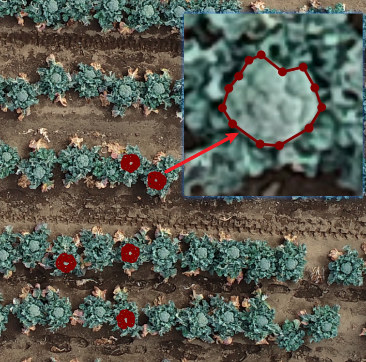
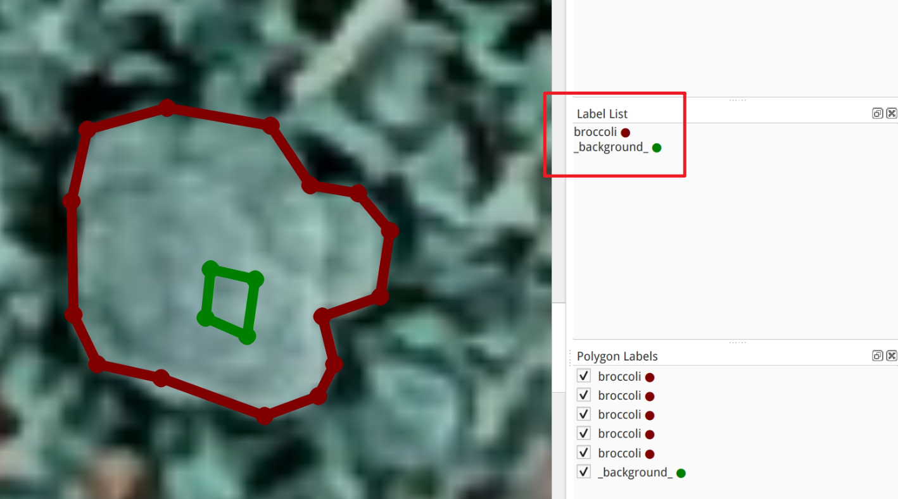
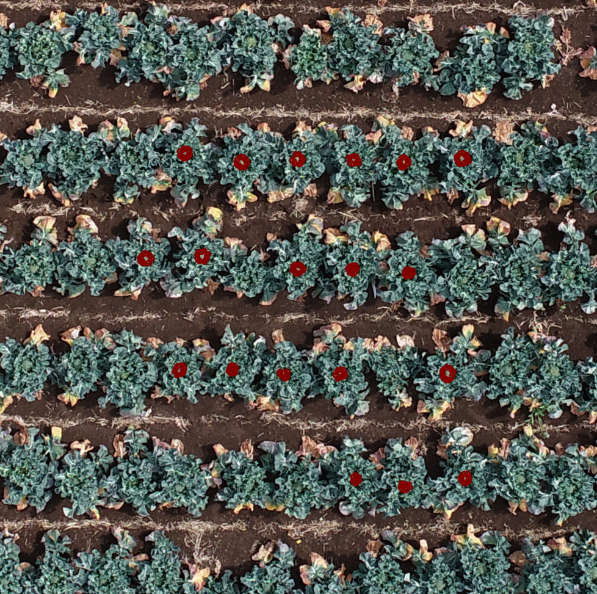
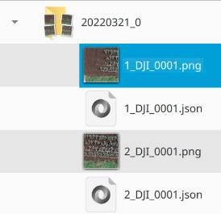
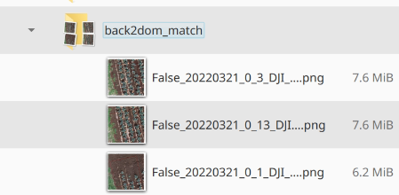

# Step 4: Segment broccoli head

## 4.1 Backward projection

Run the `01_prepare_data.py`​ similiarly as previou steps in **Step 3**, remember to change the `config.py`​ to your project first.

* ​`root_shp`​  -  the shp file of Step 3 detected and manually adjusted head positions
* ​`grid_shp`​ - the shp file of grids that split full field to several small parts
* ​`project_outputs_folder`​ - the folder to save output files
* ​`crop_img_size`​ - `<int>`​ the size of output backward projected results
* ​`process_date`​ - the batch processing list for time-series data. It is a dict object with following items:

  ```python
  {

  # date 1
  date_id: {
      project: '2021_broccoli.psx',
      chunk_id: 'chunk_name(e.g. 20210304)', # the case of putting all chunks in one psx file 
      dom: 'path/to/output/dom.tif',
      dsm: 'path/to/output/dsm.tif',
      pcd: 'path/to/output/pcd.ply'
  }

  # date 2
  ...

  }
  ```

## 4.2 Interactivate annotation

In this part, using 3 scripts: 

* ​`02_pick_img.py`​: randomly pick images for annotation from databases

  * If is the first round (initialize), this script  just pick images and save to `labelme.json`​ files
  * If running the second+ round (with trained BiSeNet models), the script call model to segment and then convert segment results to `labelme.json`​ file
* ​`03_labelme_annotate.py`​: run the labelme GUI and automatically load the images picked in previous steps
* ​`04_train.py`​: use the labelled images to train BiSeNet segmentation models

Remember to edit the `config.py`​ before using these scripts, please carefully follow the format of example code, and don't need to make changes in most cases.

* ​`supported_suffix`​ -  the allowed image suffix, e.g. `['.jpg', '.png']`​
* ​`annotation_path`​ \-  the folder to temporary save the `labelme.json`​ produced by `02_pick_img.py`​
* ​`annotation_train_path ​`​\= the folder to save results after `03_labelme_annotate.py`​
* ​`labeled_image_database`​ \= the csv file path to save the information for randomly pick of annotations

### 1) initialize training data (starts)

Run `02_pick_img.py`​, it will create the following files in `annotations`​ folder:

* ​`json_index.csv`​ - database for recording with image has already been randomly picked, produced by ​`labeled_image_database`​
* ​`tbd/`​ - folder with several `json`​ files, this is the picked images for annotation

---

Then run `03_labelme_annotation.py`​, it will pop up a labelme GUI with previous randomly picked image files.

Please just label a few (around 5) broccoli head **close to the image center** for each image, remember to save frequently when doing the labelling

​​

PS: if you need to exclude some region from head polygon, please use `_background_`​ as background annotation, this label is also editable in `config.py`​

​`classes= ["broccoli", "_background_"]`​

​​

**Error solving**

```bash
(uavbroccoli) > python 03_labelme_annotate.py                     
Traceback (most recent call last):
  File "03_labelme_annotate.py", line 7, in <module>
    subprocess.check_output(
  File "/home/crest/Applications/miniconda3/envs/uavbroccoli/lib/python3.8/subprocess.py", line 411, in check_output
    return run(*popenargs, stdout=PIPE, timeout=timeout, check=True,
  File "/home/crest/Applications/miniconda3/envs/uavbroccoli/lib/python3.8/subprocess.py", line 512, in run
    raise CalledProcessError(retcode, process.args,
subprocess.CalledProcessError: Command 'python ../labelme/__main__.py /home/crest/z/hwang_Pro/data/2022_tanashi_broccoli/12_head_segment/annotations/tbd --nodata' died with <Signals.SIGABRT: 6>.
```

execute the code after `subprocess.CalledProcessError: Command`​ 

```bash
(uavbroccoli) > python ../labelme/__main__.py /home/crest/z/hwang_Pro/data/2022_tanashi_broccoli/12_head_segment/annotations/tbd --nodata
QObject::moveToThread: Current thread (0x556ca283dbd0) is not the object's thread (0x556ca2d3c440).
Cannot move to target thread (0x556ca283dbd0)

qt.qpa.plugin: Could not load the Qt platform plugin "xcb" in "/home/crest/Applications/miniconda3/envs/uavbroccoli/lib/python3.8/site-packages/cv2/qt/plugins" even though it was found.

This application failed to start because no Qt platform plugin could be initialized. Reinstalling the application may fix this problem.
Available platform plugins are: xcb, eglfs, linuxfb, minimal, minimalegl, offscreen, vnc, wayland-egl, wayland, wayland-xcomposite-egl, wayland-xcomposite-glx, webgl.

zsh: IOT instruction (core dumped)  python ../labelme/__main__.py  --nodata
```

Solution

> ```bash
> pip uninstall opencv-python
> pip install opencv-python-headless
> ```
>
> https://github.com/wkentaro/labelme/issues/842#issuecomment-1697409034

### 2) training models

After labeling all the randomly picked image, please execute the script `04_train.py`​, this script moves those `labelme.json`​ files from `.../annotation/tbd/`​ to `.../annotation/train`​ first, when run the BiSeNet training scripts automatically. 

Then configs of BiSeNet model can be edited from `config.py`​ file:

```python
########################
# 04 train_model       #
########################
device= "cuda"
number_epochs= 200
batch_size = 64
learning_rate= 0.0005
beta_1= 0.5
beta_2= 0.999
image_size= 128
classes= ["broccoli", "_background_"]
coco_path= r"./bisenet/__pycache__/coco.json"

# outputs
ckpt_folder= r"./bisenet/__pycache__/ckpt"
temp_results= r"./bisenet/__pycache__/temp_results"
model_weight=r"./bisenet/__pycache__/ckpt/epoch200.tar"
```

### 3) manual fix errors

After training model, we can use it to do interactive annotations.

Then we repeat the **Step 1) initialize training data**, to prepare the 2nd round images for annotation. Since we already trained a BiSeNet model, this time it randomly picks severals images and applies the segmentation model on them automatically. It saves the labelme json format to `.../annotations/tbd`​ again.

Then execute `03_labelme_annotation.py`​ again, when this time open, you will find almost all broccoli head inside the center were labeled

​

No need to pay attention to thoes missing broccoli head (the are outside current grid), just manually correct those existing polygon boundaries, save them.

### 4) iterative repeat until well trained

Repeat the previous steps of `02_pick_imgs.py`​, `03_labelme_annotate.py`​, and `04_train.py`​, until the BiSeNet model segment almost correct when opening the labelme GUI and no need extensive adjustment.

### 5) apply model to all images

Execute `05_apply2all.py`​ to run the segmentation to all broccoli images. Rememeber to edit the `config.py`​ to specify the output folder before running (in most case, no need to change).

It will produce an preview image with a json file for each image of each flight date, and a total `out_results.json`​ to store all segmentation results

​​

## 4.3 forward projection and traits calculation

The previous segmentation results are on raw UAV images, the unit is just pixels without actual size (meters). Hence, to calculate the actual size of each segmentation polygon, we need to forward project thoes segmentation results from raw UAV image coordinates to DOM (geo) coordinates.

The `06_back2dom_note.ipynb`​ is a notebook to detailly show how this is finishded step by step, after understanding the workflow, you can execute the `06_back2dom.py`​ to calculate several geometric traits of each broccoli automatically.

The forward projection result preview will be displayed in the `back2dom_match`​ folder

​​

If the file name starts at `False`​, please carefully pay attention to that grid, it may contain some matching errors from the polgyon to head position. Please check them and `error.log`​ carefully and record to postprocessing.

The morpholocally traits of each broccoli head is also recoreded to `props_all.xlsx`​, you can use it as the final results
