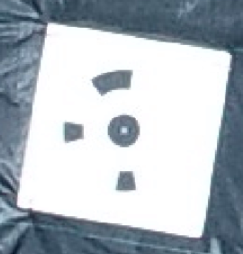
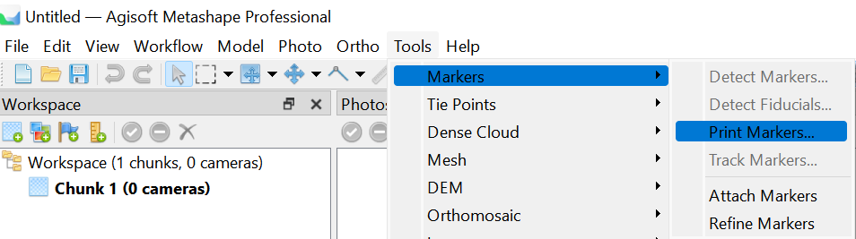

# Protocol for broccoli data analysis by Metashape

This is the code part of the protocol. The full pipeline including the following steps:

1. Collect and organize the UAV image data
2. 3D reconstruction the field model by Metashape.
3. Broccoli root position detection at early stage    
4. Broccoli head segmetation at flowering stage    

The folder structure of this project:

1. `01_slice`, `02_raw_clip`, `03_data_ana` **please ignore them**, they are **previous version** for **Pix4D** project (2019-2021 summer data) only for inner archives, the files are arranged in a mess, hard to use and will not be maintained anymore (but contains draft of deviation)
2. `10_agisoft_batch_tools` is the batch processing code for **Metashape 3D reconstruction**
3. `11_root_pos` is the code for **root position detection**   
4. `12_head_seg` is the code for **broccoli head segmentation**
5. `13_price_predict` is the R script for price prediction.
5. `Labelme` is the modified version from: 

## Dependices

We embedded the following project code directly into our project to ensure the reproductivity. The MIT license **only applies to the code of the broccoli processing part**, rather than these dependices, please kindly follow their original license.

* **Labelme** (forked and modified from https://github.com/wkentaro/labelme, AGPL-3.0 License, see `labelme/LICENSE` file, you can also access it at: https://github.com/UTokyo-FieldPhenomics-Lab/labelme-easypcc)
* **Yolo V5** (forked from https://github.com/ultralytics/yolov5, AGPL-3.0 license, see `11_root_positions/yolov5/LICENSE` file)
* **BiSeNet V2** (forked from https://github.com/CoinCheung/BiSeNet, MIT license, see  `12_head_seg/bisenet/LICENSE` file)
* **EasyRIC** (the v1.0 verion of our EasyIDP package, MIT license, see https://github.com/UTokyo-FieldPhenomics-Lab/EasyIDP/tree/v1.0 for the archived version)
* **EasyIDP** (the v2.0 version of our EasyIDP package, MIT liences, see https://github.com/UTokyo-FieldPhenomics-Lab/EasyIDP for the latest version)


## Usage

### Step 0: Setup enviroments

Recommend to use `conda` to manage and install this project.

```bash
conda env create -n uavbroccoli -f "path/to/this/project/conda_requirements-[os].yml"
...# after successful install
conda activate uavbroccoli
```

If you meet the premission problem even in the admin/sudo, please update local Conda to the latest version:

```bash
conda update -n base -c defaults conda
```

### Step 1: Collect UAV data

Please using RTK UAV and automate flight route plan software to control drones to ensure enough overlapping and image quality. Also, please set auto-detectable ground control point board (recommend 75cm x 75 cm for 15m flight) in the field:

| 16bit coded target                                                    | How to get them                                     |
| --------------------------------------------------------------------- | --------------------------------------------------- |
|  |  |

After collection the images, please organize the data folder as follows:

```plaintxt
.
├── 00_rgb_raw
│   ├── broccoli_tanashi_5_20211021_P4RTK_15m
│   │   ├── DJI_0224.JPG
│   │   ├── ...
│   │   └── DJI_0226.JPG
│   ├── broccoli_tanashi_5_20211025_P4RTK_15m
│   ├── ...
│   ├── broccoli_tanashi_5_20220411_P4RTK_15m
│   └── broccoli_tanashi_5_20220412_P4RTK_15m
├── 01_metashape_projects
│   ├── bbox.pkl
│   ├── broccoli.files
│   ├── broccoli.psx
│   └── outputs
└── 02_GIS
    └── gcp.csv
```

* `00_rgb_raw`: uav image folder, the subfolder is each flight
* `01_metashape_projects`: folder for 3D reconstruction
  * `*.psx `& `*.files` -> metashape project files
  * `outputs` -> produced DOM, DSM maps and point clouds
  * `bbox.pkl` -> plot bounding box files made by our scripts (will be created automatically later)
* `02_GIS`  -> GIS files
  * `gcs.csv` -> ground control points measured by RTK devices, it also need to make the following coded panel first

### Step 2: 3D reconstruction

Please refer to [this document](10_agisoft_batch_tools/readme.md) in `10_agisoft_batch_tools`

### Step 3: Position detection

Please refer to [this document](11_root_pos/readme.md) in `11_root_pos`

### Step 4: Head segmentaion

Please refer to [this document](12_head_seg/readme.md) in `12_head_seg`
